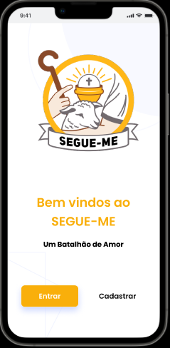
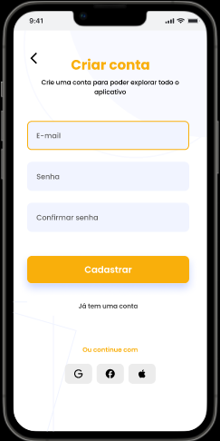
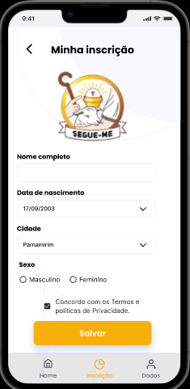
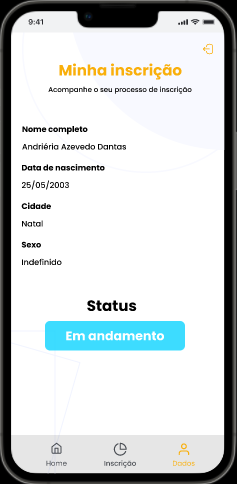
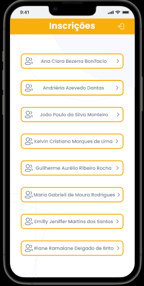
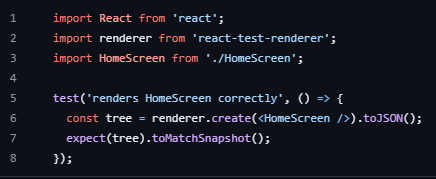
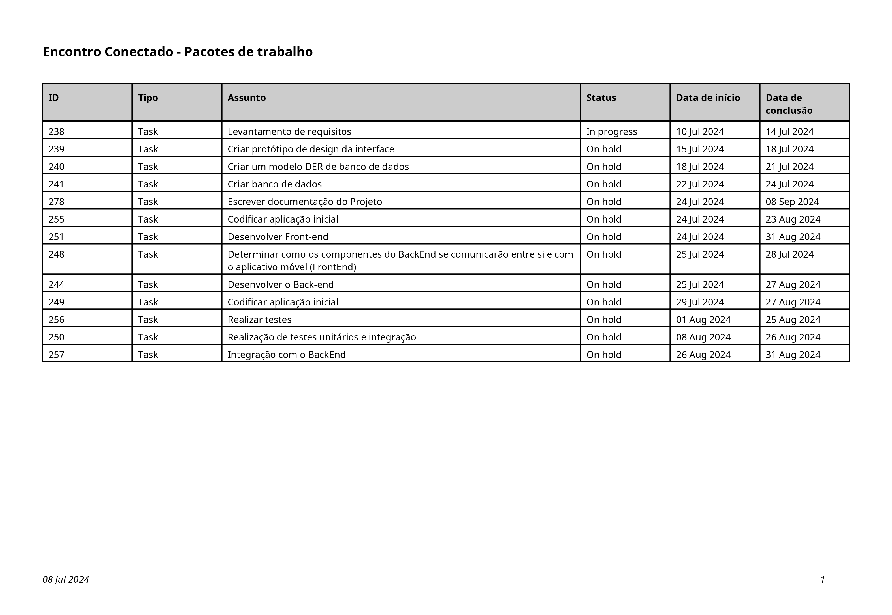

# MVP - Projeto Segue-Me
### Prof. Dr. Valério Gutemberg
#### :pencil: Discentes: Andriéria Dantas, Guilherme Aurélio,
#### João Paulo, Kelvin Marques, Maria Gabrieli e Riane Brito
#### :pencil: Disciplina de Projeto Integrador 2
:pencil2: Curso de Sistemas para Internet

---

1. **Proposta do Projeto**
   - Visão geral do aplicativo "Encontro Segue-Me"
   - Problemas enfrentados e soluções propostas

2. **Interfaces Gráficas**
   - Apresentação das interfaces desenvolvidas
   - Detalhamento do design e usabilidade

3. **Testes de Software**
   - Importância dos testes
   - Métodos de teste a serem aplicados

---

4. **Atividades/Cronograma**
   - Planejamento das atividades
   - Cronograma de execução

5. **MVP (Minimum Viable Product)**
   - Definição e objetivos do MVP
   - Implementação inicial e validação das ideias

6. **Integração com Disciplinas**
   - Relação do projeto com as disciplinas abordadas

---

## Proposta do Projeto

Este projeto tem como foco o desenvolvimento do "Encontro Segue-Me", um aplicativo mobile projetado para otimizar a organização do evento religioso Segue-Me. A principal dificuldade enfrentada pela Equipe Dirigente (ED) do encontro está na complexidade de gerenciar o cadastro dos participantes e disseminar informações sobre as inscrições de forma eficaz. 

---

## Solução

O "Encontro Conectado" surge como uma solução, oferecendo uma plataforma intuitiva e abrangente para simplificar o cadastro, sem necessidade da inscrição ser de forma manual, e melhorar a comunicação com os participantes.

---

# Interfaces Gráficas

---

## Home

 

A tela inicial do aplicativo é nosso ponto de partida e oferece uma visão geral do
evento. A tela inclui botões de navegação claros para as outras seções do aplicativo, como login e cadastro.

---

## Cadastro

A tela de cadastro é destinada aos usuários que desejam se registrar para o
evento. Aqui, os usuários são solicitados a fornecer informações como e-mail,
senha, confirmação de senha.

---

## Login

Esta tela permite que os usuários entrem em suas contas para acessar as
funcionalidades do aplicativo.

---

## Quero Participar

Após fazer o login, os usuários podem acessar a tela de inscrição para completar o
processo de registro no evento. Nesta tela, o usuário recebe as opções de “participar” ou “acompanhar inscrição”.

---

## Participar

Caso o usuário escolha a primeira opção, será direcionado para “Inscrição”. Nesta tela, ele irá preencher os campos com seus dados, além de concordar com os Termos de Uso e um botão “Salvar Alterações” para confirmar as mudanças nos campos do perfil.

---

## Acompanhar inscrição

Caso o usuário prefira “acompanhar a inscrição” será direcionado para “Dados”, onde é mostrado as informações e status da sua inscrição.

---

## Inscrições - Administrador

A primeira do administrador exibe as inscrições, permitindo que o admin do evento veja todas as inscrições recebidas. É uma lista das pessoas inscritas. Os itens da lista são clicáveis, levando o administrador a uma visualização mais detalhada de cada inscrição.

---

## Participante - Administrador

Permite que o administrador veja os detalhes completos de uma inscrição específica e tome uma decisão sobre aceitá-la ou rejeitá-la. Essa ação pode ser realizada através dos botões, permitindo atualizar o status da inscrição rapidamente.

---

## Testes de Software

Durante o desenvolvimento do aplicativo, serão realizados testes de software rigorosos para garantir a funcionalidade, usabilidade e segurança da plataforma, assegurando que a solução atenda às expectativas e necessidades da equipe organizadora e dos participantes.

O Jest é um framework de testes em JavaScript, projetado para ser rápido, fácil de configurar e eficiente. Amplamente utilizado em projetos que envolvem React Native e Node.js, ele permite escrever testes automatizados que garantem a qualidade do código, facilitam a manutenção e oferecem feedback rápido durante o desenvolvimento. Suas funcionalidades, como suporte a mocking, criação de snapshots e geração de relatórios de cobertura de código, fazem do Jest uma ferramenta essencial para desenvolver aplicações confiáveis e robustas.

---

## Testes no Back-End

No backend, serão realizados testes unitários para garantir que cada componente individual da aplicação funcione corretamente e testes de integração para verificar a interação entre diferentes módulos e componentes.

---

## Testes no Front-End

No frontend, serão realizados testes de interface de usuário (UI) para garantir que os elementos visuais e a experiência do usuário estejam de acordo com o esperado, além de testes end-to-end para simular o comportamento do usuário e verificar o fluxo completo da aplicação.

---

---

### Teste Front-End (Jest)

---

# Atividades/Cronograma

---

---

---

## MVP

Primeira implementação bem simplificada do projeto, apenas para validar as ideias, um MVP que é uma versão reduzida da solução proposta. Esta serve também para avaliar a tração com consumidores potenciais.
